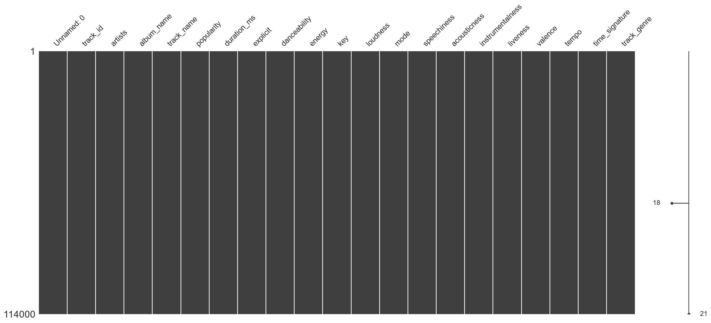
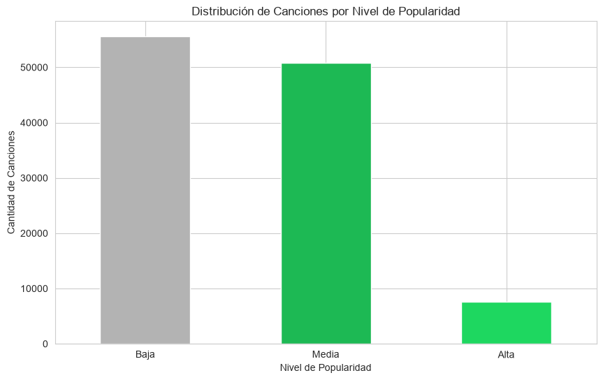
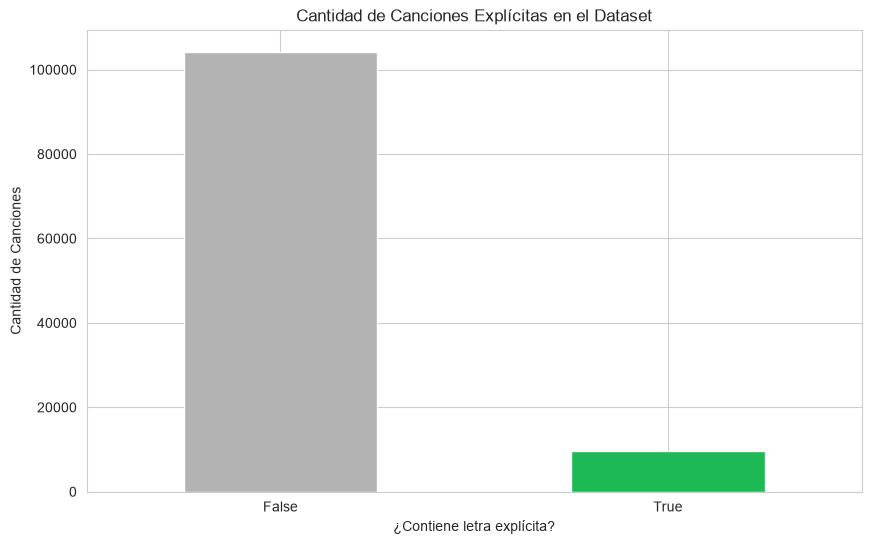
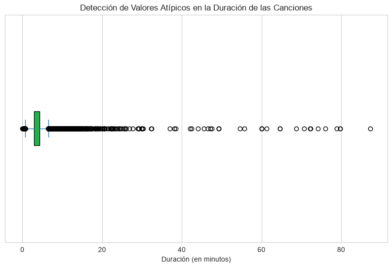
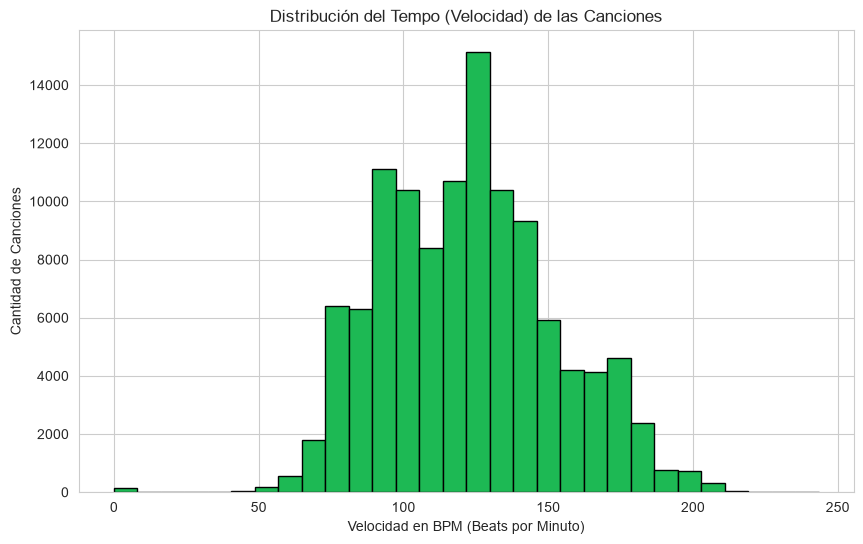
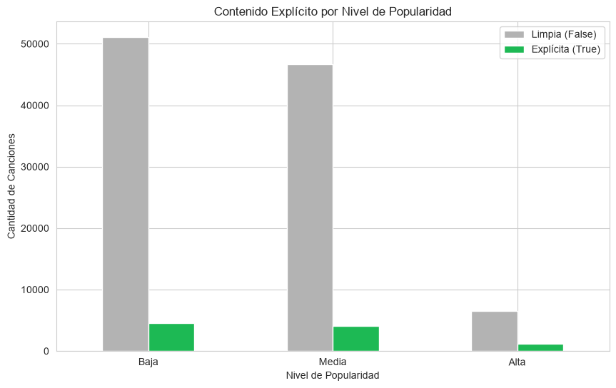
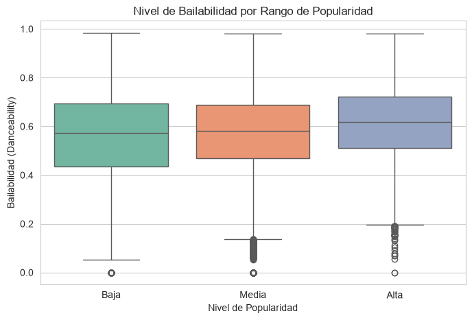
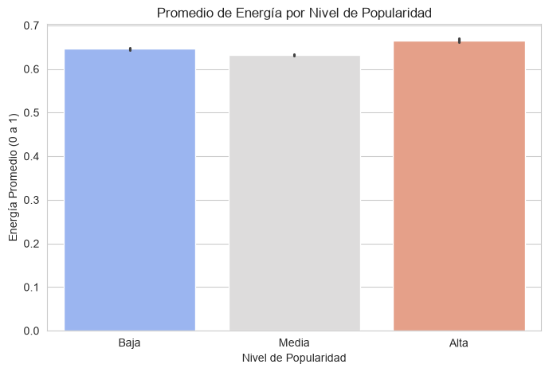
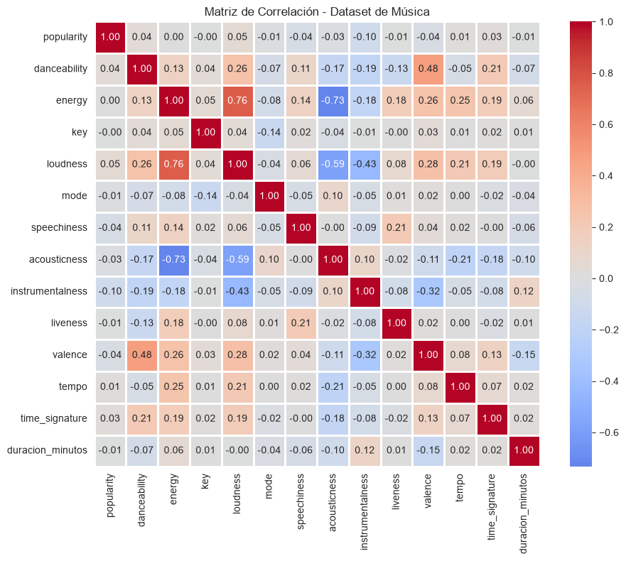

# REPORTE DE ANÁLISIS EXPLORATORIO DE DATOS (EDA): CATÁLOGO DE SPOTIFY

---

## PARTE 1: CALIDAD Y LIMPIEZA DE LOS DATOS

### 1.1 Matriz de Valores Faltantes

Al iniciar el proyecto, se evaluó la calidad de la información mediante la librería `missingno` para identificar la presencia de registros nulos o vacíos. Como se puede apreciar en el gráfico superior, todas las columnas muestran un bloque gris sólido y continuo desde la primera hasta la última fila (114,000 registros). 

Esto confirma visualmente que contamos con un dataset sumamente robusto con un **0% de valores faltantes** en el grueso de las variables analizadas. El indicador lateral derecho con el número 18 solo resalta que existen filas muy aisladas donde faltan pequeños metadatos de texto, lo cual es estadísticamente insignificante y nos permite avanzar al análisis sin necesidad de aplicar técnicas agresivas de eliminación o imputación de datos.

---

## PARTE 2: ANÁLISIS UNIVARIADO (Distribución de Variables)

### 2.1 Distribución de las Canciones por Nivel de Popularidad

Observando el gráfico de barras de arriba, queda en evidencia que el catálogo está compuesto en su gran mayoría por música clasificada en niveles de popularidad "Baja" y "Media", superando ambas los 50,000 registros. En contraste, la categoría de popularidad "Alta" representa una fracción mínima del total (menos de 10,000 canciones). Este comportamiento refleja de forma muy fiel la realidad de la industria musical actual, donde alcanzar un impacto masivo en plataformas de *streaming* es un fenómeno competitivo reservado solo para un porcentaje selecto de pistas.

### 2.2 Cantidad de Canciones Explícitas en el Dataset

Como se observa en la gráfica superior, la distribución del contenido explícito revela que las canciones catalogadas como aptas para todo público (`False`) dominan el conjunto de datos de forma abrumadora con más de 100,000 pistas. Por su parte, las canciones con contenido explícito (`True`) apenas rozan las 10,000 unidades. Esto demuestra una clara tendencia editorial hacia la distribución de música comercialmente limpia, apta para formatos de radio tradicional, listas de reproducción familiares y perfiles aptos para menores.

### 2.3 Detección de Valores Atípicos en la Duración de las Canciones

El gráfico de caja (`boxplot`) superior nos regala un hallazgo crítico sobre el comportamiento físico de las pistas. Aunque el 50% central de los datos (la caja verde) se comprime perfectamente en el estándar comercial de **3 a 4 minutos**, la presencia de una densa línea de puntos negros que se extiende hacia la derecha hasta los 80 minutos delata la presencia de valores atípicos (*outliers*). Esto nos avisa que el dataset incluye archivos de larga duración (como podcasts de audio, sets grabados en vivo o álbumes completos integrados en una sola pista) que requerirán un filtrado especial antes de entrenar un modelo de Machine Learning.

### 2.4 Distribución del Tempo (Velocidad) de las Canciones

En el histograma de arriba se aprecia una distribución simétrica casi perfecta (distribución Normal). El pico más alto de la campana se concentra con fuerza en el rango de los **120 a 130 BPM** (Beats por Minuto). Estadísticamente, esta velocidad es el estándar universal utilizado en la música pop, dance, reggaetón y ritmos comerciales de radio, lo que ratifica que el catálogo de Spotify está diseñado bajo los patrones de velocidad idóneos para el movimiento humano y el consumo masivo.

---

## PARTE 3: ANÁLISIS BIVARIADO (Relación entre Variables)

### 3.1 Contenido Explícito por Nivel de Popularidad

Al cruzar las variables mediante el gráfico superior, se detecta que la proporción entre canciones limpias (gris) y explícitas (verde) se mantiene prácticamente idéntica en los tres niveles de popularidad (Baja, Media y Alta). Este hallazgo es muy valioso, ya que demuestra que incluir lenguaje explícito en las letras no genera ningún impacto o ventaja matemática para alcanzar el éxito comercial; la distribución de consumo se comporta de manera independiente a esta etiqueta.

### 3.2 Nivel de Bailabilidad por Rango de Popularidad

Mirando los diagramas de caja de arriba, se observa un patrón sutil pero constante: a medida que subimos en el rango de popularidad, la caja se desplaza ligeramente hacia arriba. Específicamente, el grupo de popularidad "Alta" (caja azul) tiene su mediana notablemente por encima del valor de 0.6 en comparación con los grupos de popularidad Baja y Media. Esto nos indica que **las canciones altamente exitosas tienden a ser más bailables**, lo que convierte a la bailabilidad (`danceability`) en una variable predictora clave para el éxito en la plataforma.

### 3.3 Promedio de Energía por Nivel de Popularidad

A diferencia de la bailabilidad, el gráfico de barras superior demuestra que la energía promedio se mantiene extremadamente estable en todo el catálogo. Las tres categorías (Baja, Media y Alta) registran un promedio de intensidad alto, oscilando muy cerca del **0.65**. El hallazgo aquí es que la música actual, independientemente de si se vuelve un fenómeno viral o se queda en el anonimato, se produce hoy en día bajo altos estándares de potencia y sonoridad digital.

### 3.4 Relación entre la Duración (Minutos) y la Bailabilidad

Como se puede apreciar en el gráfico de dispersión (`scatterplot`) de arriba, la relación entre la duración y la bailabilidad forma una densa pared vertical concentrada en los primeros 10 minutos que luego se dispersa aleatoriamente. Esto se traduce estadísticamente como una **ausencia de correlación**. Una canción no se vuelve más o menos bailable por el hecho de durar más minutos; ambas variables son completamente independientes en la estructura del dataset.

---

## PARTE 4: RELACIONES GLOBALES E INGENIERÍA DE VARIABLES

### 4.1 Matriz de Correlación - Heatmap

La matriz de correlación superior aporta la confirmación matemática definitiva de las dinámicas del dataset. Al analizar los coeficientes, destacan dos relaciones críticas con colores intensos:
1. Una **correlación positiva muy fuerte (0.76)** en color rojo entre la Energía (`energy`) y el Volumen (`loudness`), demostrando que viajan de la mano directamente.
2. Una **correlación negativa intensa (-0.73)** en color azul entre la Energía (`energy`) y el nivel acústico (`acousticness`), indicando que a mayor presencia de instrumentos acústicos tradicionales, menor es la energía procesada de la pista. 

Estos números nos dictan exactamente qué variables interactúan entre sí, permitiendo optimizar el diseño de características para la fase predictiva.

---

## PARTE 5: COMPLEMENTOS Y ANÁLISIS EXTRAS

El dataset se encuentra en perfectas condiciones técnicas. Para el futuro desarrollo de modelos de Machine Learning, se concluye que **las variables principales a utilizar como predictores deben ser la Energía, el Volumen y la Bailabilidad**, ya que sus correlaciones e interacciones son las que mejor explican la popularidad y el comportamiento de la música en este ecosistema.